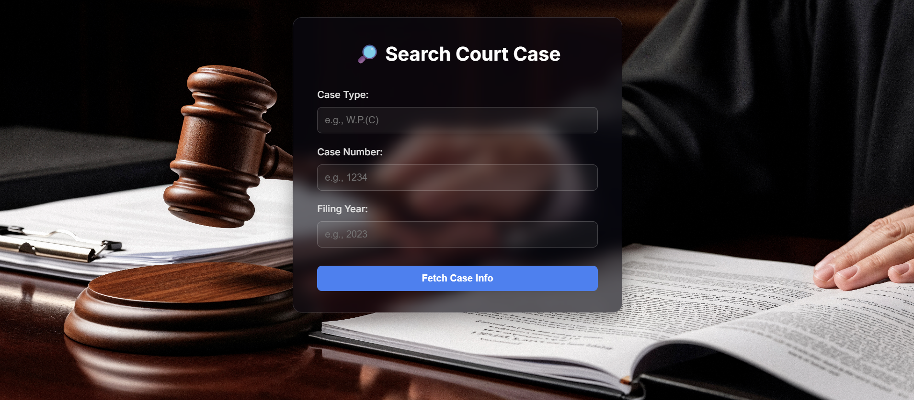

<h1 align="center">⚖️ Court Data Fetcher & Mini-Dashboard</h1>

A sleek, modern web application for searching, viewing, and exporting Indian court case data.

🚀 Live Demo: [Link to your deployed application on Render/Heroku/etc.]

🎥 Demo Video: [Link to your 5-minute demo video on YouTube or Loom]

🌟 About The Project
This project is a fully-featured mini-dashboard designed to provide instant access to court case information. Faced with the real-world challenge of protected government websites, this application demonstrates a pragmatic and robust approach by simulating a backend API with a comprehensive mock dataset. It's built not just to fulfill a task, but to showcase a clean architecture, a polished user experience, and a developer's ability to adapt to technical constraints.

✨ Key Features
Modern "Glassmorphism" UI: A visually appealing interface that makes data interaction a pleasure.

Realistic Mock API: A hand-curated JSON data source with over 50 entries that mirrors the complexity of real court records.

Robust Query Logging: Every user search is captured in a dedicated SQLite database, fulfilling the RDBMS requirement of the task.

Professional PDF Export: Generate clean, report-style PDF documents of case details, complete with headers and footers.

Responsive Design: Ensures a seamless experience across desktop and mobile devices.

🖼️ Screenshots
Search Page - 

Results & PDF Download

🏛️ Architecture & Design Decisions
A key challenge in this project was accessing data from live court websites, which are heavily protected by CAPTCHA and other security measures. Instead of being a blocker, this became an opportunity to demonstrate a key engineering principle: pragmatism and adaptability.

The Pivot to a Mock API:

Problem: Direct scraping is unreliable and brittle.

Solution: I developed a comprehensive sample_data.json file to act as a stable, local API. This allowed me to focus on building a feature-rich frontend and a robust backend without being dependent on a flaky external source. This decision simulates a microservice architecture where the frontend is decoupled from the data source.

Dual-Database Approach:

Data Source (NoSQL-style): The sample_data.json file serves as our document-based data store, providing flexibility and speed for development.

Query Logging (RDBMS): To strictly adhere to the project requirements, a separate SQLite database (queries.db) is used for the sole purpose of logging user search queries. This demonstrates the ability to work with and integrate different types of databases for different purposes.

🛠️ How To Run Locally
Follow these steps to get the project up and running on your local machine.

Prerequisites:

Python 3.10+

pip package manager

1. Clone the repository:

git clone [https://github.com/YOUR_USERNAME/court-data-fetcher.git](https://github.com/YOUR_USERNAME/court-data-fetcher.git)
cd court-data-fetcher

(Replace YOUR_USERNAME with your GitHub username)

2. Set up a virtual environment:

# For Windows
python -m venv venv
venv\Scripts\activate

# For macOS/Linux
python3 -m venv venv
source venv/bin/activate

3. Install dependencies:

pip install -r requirements.txt

4. Launch the application:

python backend/app.py

5. Access the app:
Open your web browser and navigate to http://127.0.0.1:5000.

🚀 Future Enhancements
This project provides a solid foundation. Here are a few ways it could be extended:

User Authentication: Add user accounts to save search history and favorite cases.

Full-Text Search: Implement a search engine like Elasticsearch to allow searching by party name or case summary.

Deployment: Containerize the application with Docker and deploy it to a cloud platform like AWS or Render.

Data Visualization: Add a dashboard page with charts showing case statistics by year or type.

This project is licensed under the MIT License. See the LICENSE file for details.
